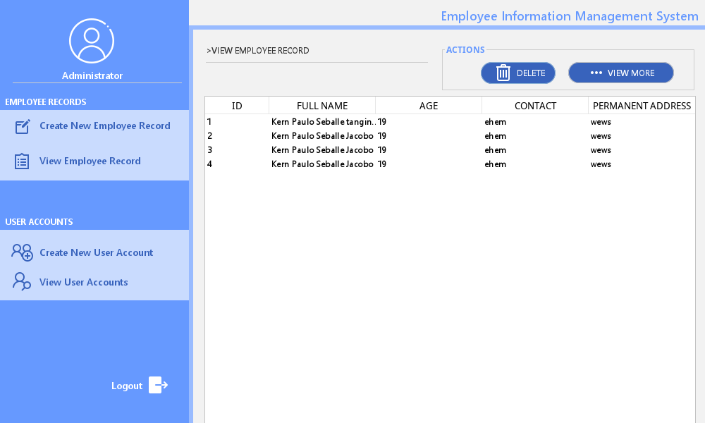

# Employee Information Management System

## Tools and IDE
[Docker](https://www.docker.com/ "Docker: Accelerated, Containerized Application Development")  
[MySQL Docker image](https://hub.docker.com/_/mysql "mysql - Official Image | Docker Hub")  
[Apache NetBeans](https://netbeans.apache.org/)

## Libraries used
[MySQL Connector J](https://github.com/mysql/mysql-connector-j "mysql/mysql-connector-j : MySQL Connector/J")  
[FlatLaf](https://github.com/JFormDesigner/FlatLaf "JFormDesigner/FlatLaf: FlatLaf - Swing Look and Feel (with Darcula/IntelliJ themes support)")

## Screenshots
  

### By De Guzman, Seño, Abrigo, Jacobo
